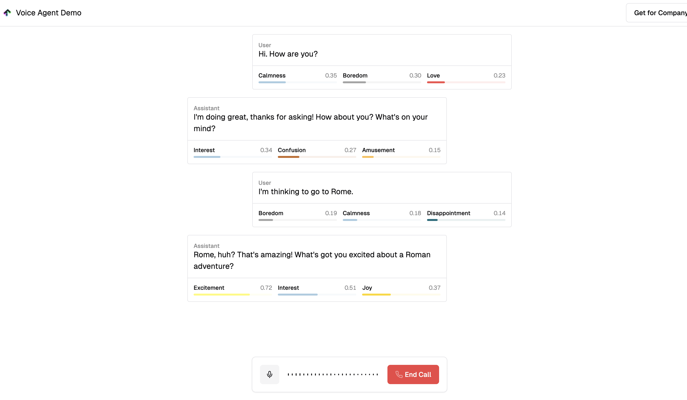

  
  <h1>FRACTZ Voice Agent - Demo</h1>

## Overview

This project showcases a sample implementation of Hume's advanced **AI Voice Agent** solution. The implementation demonstrates how to build an interactive voice interface using Hume's React SDK. It features seamless integration with Next.js, leveraging modern technologies for a natural and human-like conversational experience.

## Project Deployment

Deploy this example project easily using Vercel by following the steps below:

1. **Create a Git Repository**: Set up a new repository to host your project files.
2. **Configure Environment Variables**: Ensure all required environment variables are provided. To obtain your API key and Client Secret key, log in to the Hume portal and navigate to the [API keys page](https://beta.hume.ai/settings/keys).
3. **Click Deploy**: Use the deployment button provided to launch your project effortlessly.
